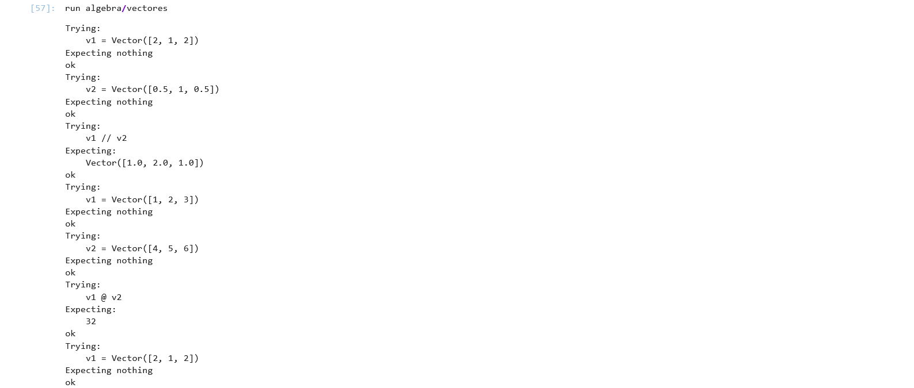
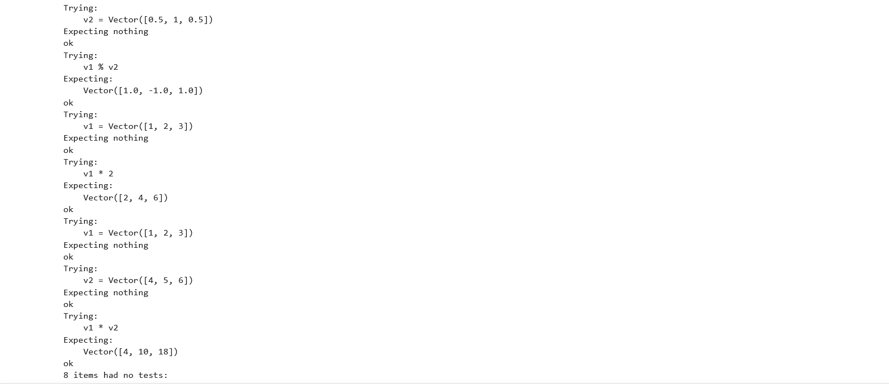
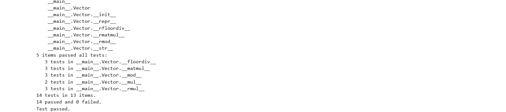

# Tercera tarea de APA: Multiplicación de vectores y ortogonalidad

## Nom i cognoms

> [!Important]
> Introduzca a continuación su nombre y apellidos:
>
> Oriol López Miret

## Aviso Importante

> [!Caution]
>
> 
> El objetivo de esta tarea es programar en Python usando el paradigma de la programación
> orientada a objetos. Es el alumno quien debe realizar esta programación. Existen bibliotecas
> que, sin lugar a dudas, lo harán mejor que él, pero su uso está prohibido.
>
> ¿Quiere saber más?, consulte con el profesorado.
  
## Fecha de entrega: 6 de abril a medianoche

## Clase Vector e implementación de la multiplicación de vectores

El fichero `algebra/vectores.py` incluye la definición de la clase `Vector` con los
métodos desarrollados en clase, que incluyen la construcción, representación y
adición de vectores, entre otros.

Añada a este fichero los métodos siguientes, junto con sus correspondientes
tests unitarios.

### Multiplicación de los elementos de dos vectores (Hadamard) o de un vector por un escalar

- Sobrecargue el operador asterisco (`*`, correspondiente a los métodos `__mul__()`,
  `__rmul__()`, etc.) para implementar el producto de Hadamard (vector formado por
  la multiplicación elemento a elemento de dos vectores) o la multiplicación de un
  vector por un escalar.

  - La prueba unitaria consistirá en comprobar que, dados `v1 = Vector([1, 2, 3])` y
    `v2 = Vector([4, 5, 6])`, la multiplicación de `v1` por `2` es `Vector([2, 4, 6])`,
    y el producto de Hadamard de `v1` por `v2` es `Vector([4, 10, 18])`.

- Sobrecargue el operador arroba (`@`, multiplicación matricial, correspondiente a los
  métodos `__matmul__()`, `__rmatmul__()`, etc.) para implementar el producto escalar
  de dos vectores.

  - La prueba unitaria consistirá en comprobar que el producto escalar de los dos
    vectores `v1` y `v2` del apartado anterior es igual a `32`.

### Obtención de las componentes normal y paralela de un vector respecto a otro

Dados dos vectores $v_1$ y $v_2$, es posible descomponer $v_1$ en dos componentes,
$v_1 = v_1^\parallel + v_1^\perp$ tales que $v_1^\parallel$ es tangencial (paralela) a
$v_2$, y $v_1^\perp$ es normal (perpendicular) a $v_2$.

> Se puede demostrar:
>
> - $v_1^\parallel = \frac{v_1\cdot v_2}{\left|v_2\right|^2} v_2$
> - $v_1^\perp = v_1 - v_1^\parallel$

- Sobrecargue el operador doble barra inclinada (`//`, métodos `__floordiv__()`,
  `__rfloordiv__()`, etc.) para que devuelva la componente tangencial $v_1^\parallel$.

- Sobrecargue el operador tanto por ciento (`%`, métodos `__mod__()`, `__rmod__()`, etc.)
  para que devuelva la componente normal $v_1^\perp$.

> Es discutible esta elección de las sobrecargas, dado que extraer la componente
> tangencial no es equivalente a ningún tipo de división. Sin embargo, está
> justificado en el hecho de que su representación matemática es dos barras
> paralelas ($\parallel$), similares a las usadas para la división entera (`//`).
>
> Por otro lado, y de manera *parecida* (aunque no idéntica) al caso de la división
> entera, las dos componentes cumplen: `v1 = v1 // v2 + v1 % v2`, lo cual justifica
> el empleo del tanto por ciento para la componente normal.

- En este caso, las pruebas unitarias consistirán en comprobar que, dados los vectores
  `v1 = Vector([2, 1, 2])` y `v2 = Vector([0.5, 1, 0.5])`, la componente de `v1` paralela
  a `v2` es `Vector([1.0, 2.0, 1.0])`, y la componente perpendicular es `Vector([1.0, -1.0, 1.0])`.

### Entrega

#### Fichero `algebra/vectores.py`

- El fichero debe incluir una cadena de documentación que incluirá el nombre del alumno
  y los tests unitarios de las funciones incluidas.

- Cada función deberá incluir su propia cadena de documentación que indicará el cometido
  de la función, los argumentos de la misma y la salida proporcionada.

- Se valorará lo pythónico de la solución; en concreto, su claridad y sencillez, y el
  uso de los estándares marcados por PEP-ocho.

#### Ejecución de los tests unitarios

Inserte a continuación una captura de pantalla que muestre el resultado de ejecutar el
fichero `algebra/vectores.py` con la opción *verbosa*, de manera que se muestre el
resultado de la ejecución de los tests unitarios.





#### Código desarrollado

Inserte a continuación el código de los métodos desarrollados en esta tarea, usando los
comandos necesarios para que se realice el realce sintáctico en Python del mismo (no
vale insertar una imagen o una captura de pantalla, debe hacerse en formato *markdown*).

````python
"""
Autor: Oriol López Miret

Descripción: Contiene una classe "Vector". 
    - Multiplicar entre 2 objetos classe Vector.
    - Multiplicar 1 objeto classe Vector con 1 escalar.
    - Multiplica y despues suma los valores de 2 vectores.
    - Valores tagenciales de vector 1 con vector 2
    - Valores normalizados de vector 1 con vector 2
"""

class Vector:
    """
    Permite hacer calculos con vectores.
    """
    vector = []
    def __init__(self, iterable):
        self.vector = [expresion for expresion in iterable]

    def __repr__(self):
        return "Vector(" + repr(self.vector) + ")"

    def __str__(self):
        return str(self.vector)

    def __rmul__(self, other):
        """
        Permite multiplicar entre objetos de la misma classe.
    
        Args:
            self,other(Class): Objetos de la classe "Vector"
    
        Returns:
            list: una lista con los valores multiplicados 
    
        Tests:
            >>> v1 = Vector([1, 2, 3])
            >>> v2 = Vector([4, 5, 6])
            >>> v1 * v2
            Vector([4, 10, 18])
        """
        tmp = [v1*v2 for v1, v2 in zip(self.vector, other.vector)]
        return Vector(tmp)

    def __mul__(self, other):
        """
        Permite multiplicar un escalar o objetos de la misma classe.
    
        Args:
            self,other(Class): Objetos de la classe "Vector"
    
        Returns:
            list: una lista con los valores multiplicados 
    
        Tests:
            >>> v1 = Vector([1, 2, 3])
            >>> v1 * 2
            Vector([2, 4, 6])
        """
        if isinstance(other, (int, float)):
            tmp = [v1*other for v1 in self.vector]
            return Vector(tmp)
        else:
            return self.__rmul__(other)

    def __matmul__(self, other):
        """
        Sobre carga el operador @ dando la suma total de las 2 matrizes una vez multiplicadas.
    
        Args:
            self,other(Class): Objetos de la classe "Vector"
    
        Returns:
            list: el producto escalar de los 2 vectores
    
        Tests:
            >>> v1 = Vector([1, 2, 3])
            >>> v2 = Vector([4, 5, 6])
            >>> v1 @ v2
            32
        """
        return sum(v1 * v2 for v1, v2 in zip(self.vector, other.vector))

    def __rmatmul__(self, other):
        """
        Sobre carga el operador @ dando la suma total de las 2 matrizes una vez multiplicadas.
    
        Args:
            self,other(Class): Objetos de la classe "Vector"
    
        Returns:
            list: el producto escalar de los 2 vectores
        """
        return self.__matmul__(other)

    def __floordiv__(self, other):
        """
        Sobre carga el operador // dando los valores tangenciales
    
        Args:
            self,other(Class): Objetos de la classe "Vector"
    
        Returns:
            list: componentes tangenciales de v1 con v2

        Tests:
        >>> v1 = Vector([2, 1, 2])
        >>> v2 = Vector([0.5, 1, 0.5])
        >>> v1 // v2
        Vector([1.0, 2.0, 1.0])
        """
        sub = sum(a * a for a in other.vector)
        factor = (self @ other) / sub
        return other * factor

    def __rfloordiv__(self, other):
        """
        Sobre carga el operador // dando los valores tangenciales
    
        Args:
            self,other(Class): Objetos de la classe "Vector"
    
        Returns:
            list: componentes tangenciales de v2 con v1
        """
        return self.__floordiv__(other)
        
    def __mod__(self, other):
        """
        Sobre carga el operador % dando los valores normales
    
        Args:
            self,other(Class): Objetos de la classe "Vector"
    
        Returns:
            list: componentes normales entre v1 y v2

        Tests:
        >>> v1 = Vector([2, 1, 2])
        >>> v2 = Vector([0.5, 1, 0.5])
        >>> v1 % v2
        Vector([1.0, -1.0, 1.0])
        """
        temp = []
        for v1, v2 in zip(self.vector, self.__floordiv__(other).vector):
            temp.append(v1 - v2)
        return Vector(temp)
        
    def __rmod__(self, other):
        """
        Sobre carga el operador % dando los valores normales
    
        Args:
            self,other(Class): Objetos de la classe "Vector"
    
        Returns:
            list: componentes normales entre v2 y v1
        """
        return self.__mod__(other)
        
import doctest
doctest.testmod(verbose=True)
````

#### Subida del resultado al repositorio GitHub y *pull-request*

La entrega se formalizará mediante *pull request* al repositorio de la tarea.

El fichero `README.md` deberá respetar las reglas de los ficheros Markdown y
visualizarse correctamente en el repositorio, incluyendo la imagen con la ejecución de
los tests unitarios y el realce sintáctico del código fuente insertado.
